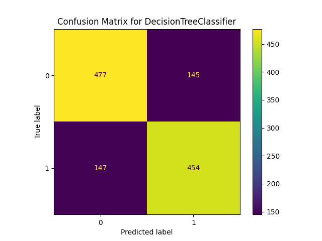
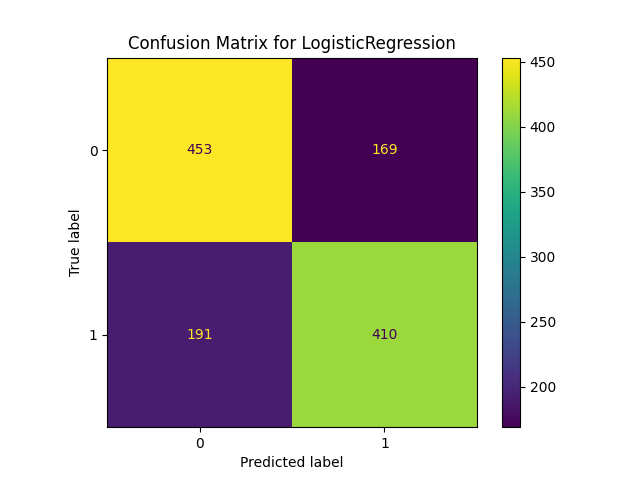
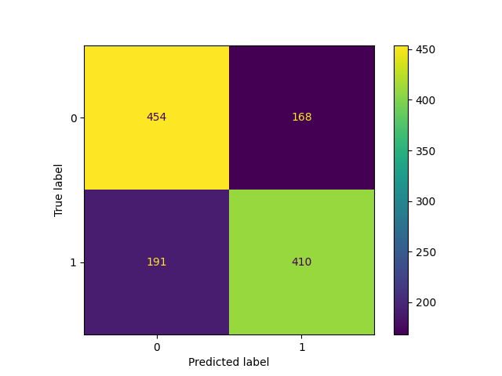

<div align="center">

# 📊 Churn Prediction Pipeline

[](https://www.python.org/)
[](https://mlflow.org/)
[](https://scikit-learn.org/)
[](LICENSE)

**A robust, end-to-end Machine Learning pipeline for predicting customer churn.**  
*Leveraging MLflow for experiment tracking, model registry, and reproducibility.*

[View Demo](https://github.com/yourusername/churn-prediction) · [Report Bug](https://github.com/yourusername/churn-prediction/issues) · [Request Feature](https://github.com/yourusername/churn-prediction/issues)

</div>

---

## 📝 About The Project

In the dynamic world of telecommunications and SaaS, customer retention is paramount. This project implements a comprehensive **Churn Prediction System** designed to identify customers at risk of leaving. 

By analyzing customer behavior and demographics, we train multiple machine learning models to predict churn probability, allowing businesses to take proactive retention measures.

### Key Features
*   **Multi-Model Training**: Automatically trains and evaluates Random Forest, Decision Tree, and Logistic Regression models.
*   **MLflow Integration**: seamless logging of parameters, metrics, and artifacts.
*   **Model Staging**: Implements a promotion logic where the best-performing models (Random Forest) are moved to Production, while valid candidates (Decision Tree) are Staged.
*   **Visualizations**: Auto-generated ROC Curves and Confusion Matrices.

---

## 📂 Project Structure

```text
├── src/
│   ├── data_preprocessing.py   # Data cleaning and feature engineering
│   ├── models_training.py      # Model training logic
│   ├── mlflow_logging.py       # MLflow tracking and artifact logging
│   └── evaluation.py           # Metric calculation and plotting
├── plots/                      # Generated visual artifacts
│   ├── ROC_curve_RandomForestClassifier.png
│   ├── ROC_curve_DecisionTreeClassifier.png
│   └── ...
├── mlruns/                     # MLflow local tracking store
├── main.py                     # Entry point for the pipeline
├── config.yaml                 # Configuration parameters
├── requirements.txt            # Project dependencies
└── README.md                   # Documentation
```

---

## 🚀 Getting Started

### Prerequisites

*   Python 3.8+
*   pip

### Installation

1.  **Clone the repository**
    ```bash
    git clone https://github.com/yourusername/churn-prediction.git
    cd churn-prediction
    ```

2.  **Install dependencies**
    ```bash
    pip install -r requirements.txt
    ```

### Usage

Run the main pipeline to preprocess data, train models, and log results to MLflow:

```bash
python main.py
```

To view the MLflow UI and explore experiments:

```bash
mlflow ui
```

---

## 🏆 Experiments & Results

We evaluated three models on the churn dataset: **Random Forest**, **Decision Tree**, and **Logistic Regression**. The models were assessed based on Accuracy, F1-Score, AUC, and Mean CV Score.

### Comparative Metrics

| Model | Accuracy | F1-Score | AUC | Mean CV Score | Status |
| :--- | :---: | :---: | :---: | :---: | :---: |
| **Random Forest** | **76.37%** | 0.7557 | **0.7634** | **0.7843** | `Production` |
| **Decision Tree** | 76.12% | **0.7567** | 0.7611 | 0.7657 | `Staging` |
| **Logistic Regression** | 70.56% | - | - | - | `Archived` |

### 🧠 Model Selection Insights

The **Random Forest Classifier** was selected for production deployment.
- **Why?** It achieved the highest **Accuracy (76.37%)** and significantly outperformed the Decision Tree in **Mean Cross-Validation Score (78.43% vs 76.57%)**, indicating better generalization and stability.
- The **Decision Tree** follows closely as a runner-up and is kept in `Staging` for potential future tuning.

---

## 📊 Visualizations

Below are the performance plots generated during the training pipeline.

### Random Forest Classifier (Best Model)
<div align="center">
  
</div>

### Decision Tree Classifier
<div align="center">
  
</div>

### Logistic Regression
<div align="center">
  
  
</div>

---

## 🤝 Contributing

Contributions are what make the open source community such an amazing place to learn, inspire, and create. Any contributions you make are **greatly appreciated**.

---

## 📜 License

Distributed under the MIT License. See `LICENSE` for more information.

---

<div align="center">
    <p>Made with ❤️ by Ahmed Gamal</p>
</div>
